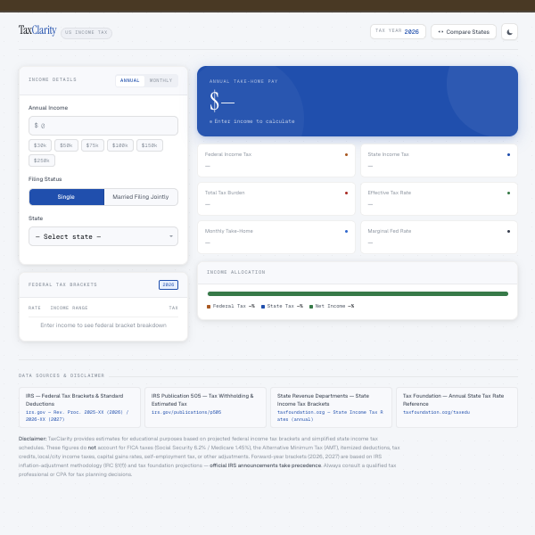

# Tools

A collection of useful tools and utilities I've built for commonly used tasks.

::: tip Featured Tools
These tools are designed to be fast, reliable, and run entirely in your browser.
:::

## 🛠️ Utility Hub

Welcome to my toolkit! This section features standalone applications and scripts I've developed to streamline workflows.
### 👨‍💻 Developed by Me
Custom-built utilities and scripts I've created to solve specific challenges.

::: tip <a href="/tax-calculator/index.html" target="_blank">US INCOME TAX CALCULATOR TOOL</a> 

*Standalone US Federal and State income tax calculator with 2025-2027 projections.*
:::
### 🌟 Community Gems
Highly useful tools built by the community that I rely on daily. Full credit goes to the original creators.

### [JWT Debugger](https://jwt.io) (Open in new tab)
*Decode and verify JSON Web Tokens on the fly.*

---

## 🚀 Scalability Notice
As this section grows, I will be adding dedicated pages for each tool with embedded live components for direct interaction.

[Back to Projects](/projects/)
